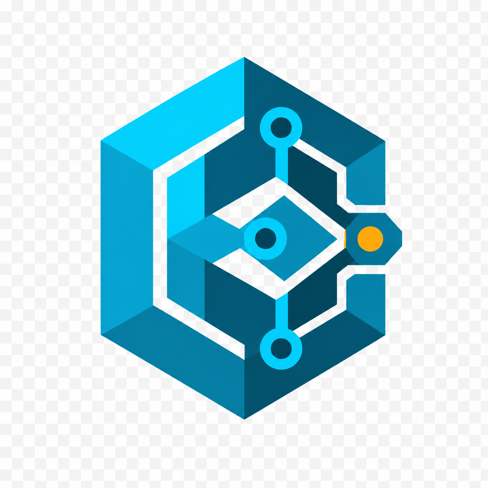
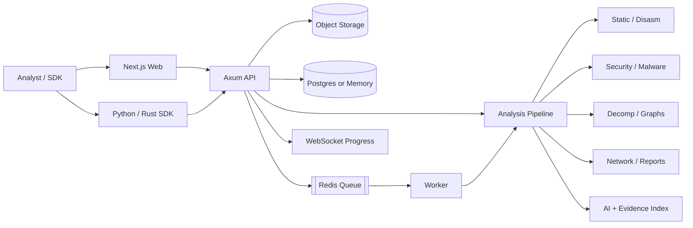
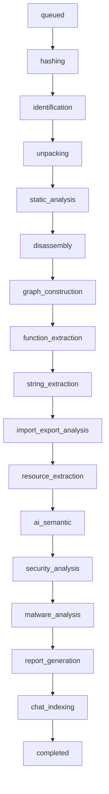
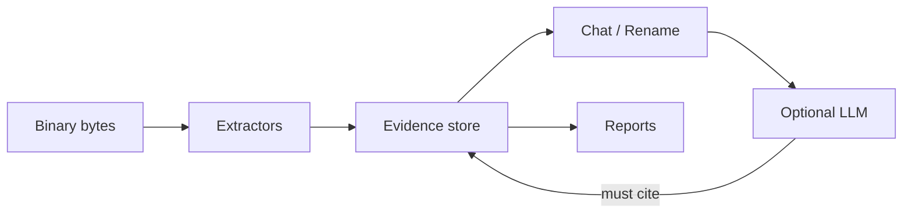

# Binaris

<p align="center">
  
</p>

<p align="center">
  <strong>AI-powered reverse engineering platform</strong><br/>
  Static analysis · evidence-bound AI chat · malware & crypto intel · graphs · DFIR reports
</p>

<p align="center">
  <a href="https://ayushkumarsingh09.github.io/Binaris/"></a>
  <a href="https://github.com/Ayushkumarsingh09/Binaris/actions"></a>
  <a href="LICENSE"></a>
</p>

### Live links

| Surface | URL |
|---|---|
| **Product landing + docs** | [https://ayushkumarsingh09.github.io/Binaris/](https://ayushkumarsingh09.github.io/Binaris/) |
| **Web workspace (hosted)** | See [Live deployment](#live-deployment) after Vercel publish |
| **API health (hosted)** | See [Live deployment](#live-deployment) after Fly publish |
| **Source** | [github.com/Ayushkumarsingh09/Binaris](https://github.com/Ayushkumarsingh09/Binaris) |

Demo credentials (local / self-hosted): `demo@binaris.dev` / `demo-password-change-me`

---

## Why Binaris

Binaris combines IDA/Ghidra-style static reverse engineering with a modern analyst workspace and AI that is **forced to cite evidence** from the binary (imports, strings, functions, entropy, crypto constants, network IOCs)—not free-form hallucination.

- Upload **PE / ELF / Mach-O / APK / JAR / MSI / firmware / raw**
- Architectures: **x86, x64, ARM, ARM64, MIPS, PowerPC, RISC-V**
- Capstone disassembly + deterministic pseudocode; optional Ghidra / Rizin / radare2
- Security, malware, crypto, and network (GeoIP / RDAP / C2) engines
- Call / CFG / imports / DFG / memory / network graphs
- Reports: Markdown, HTML, JSON, SARIF, YARA, Sigma, SBOM, PDF
- Snapshots, binary diff, restore
- Auth + Google / GitHub / OIDC hooks
- Rust Axum API · Next.js UI · Docker / K8s · Python & Rust SDKs

---

## Architecture



### Pipeline stages



### Evidence contract



---

## Repository layout

```
apps/api            Axum REST + GraphQL subset + WebSocket
apps/worker         Redis-backed analysis worker
apps/web            Next.js analyst workspace
apps/cli            CLI client
crates/*            Core, analysis, AI, malware, security, decomp,
                    network, graphs, reports, pipeline, db, auth, diff, storage
sdks/python         Python SDK
sdks/rust           Rust SDK
migrations/         Postgres schema
infra/docker        Containerfiles + Prometheus
infra/k8s           Kubernetes manifests
docs/               Architecture + GitHub Pages site
branding/           Logo (no text, transparent)
tests/e2e           Smoke scripts
```

---

## Quick start

### Local (zero infra)

```bash
# API — in-memory store, local objects, inline analysis
cargo run -p binaris-api

# Web
cd apps/web && npm install && npm run dev
```

- Web: http://localhost:3000  
- API: http://localhost:8080/healthz  

### Docker Compose

```bash
docker compose up --build
```

```bash
# Async worker profile
docker compose --profile async up --build

# Observability
docker compose --profile obs up
```

### Smoke test

```bash
bash tests/e2e/smoke.sh
```

---

## Environment

Copy [`.env.example`](.env.example). Important knobs:

| Variable | Purpose |
|---|---|
| `BINARIS_JWT_SECRET` | JWT signing secret |
| `DATABASE_URL` | Postgres (optional; memory store if unset) |
| `REDIS_URL` | Job queue (optional) |
| `BINARIS_INLINE_ANALYZE` | Run pipeline in API process (`true` by default) |
| `BINARIS_AI_PROVIDER` | `local` / `openai` / `openrouter` / `ollama` / `claude` / `gemini` |
| `BINARIS_AI_API_KEY` | Provider API key |
| `NEXT_PUBLIC_BINARIS_API_URL` | Web → API base URL |
| `BINARIS_OAUTH_*` | Google / GitHub / OIDC |
| `GHIDRA_HOME` | Optional headless decomp |

---

## API surface (selected)

| Method | Path | Description |
|---|---|---|
| `POST` | `/v1/auth/register` `/login` | Email auth |
| `GET` | `/v1/auth/oauth/providers` | Configured SSO providers |
| `GET/POST` | `/v1/projects` | Projects |
| `POST` | `/v1/projects/{id}/upload` | Binary upload + analysis |
| `GET` | `/v1/analyses/{id}` | Full analysis report |
| `POST` | `/v1/analyses/{id}/chat` | Evidence-bound chat |
| `GET` | `/v1/analyses/{id}/search` | Indexed search |
| `GET` | `/v1/analyses/{id}/reports` | Export bundle |
| `GET` | `/v1/analyses/{id}/graphs/{kind}` | `call` `cfg` `imports` `dfg` `memory` `network` |
| `POST` | `/v1/analyses/{id}/snapshots` | Snapshot / restore / diff |
| `GET` | `/healthz` `/readyz` `/metrics` | Ops |

GraphQL subset: `POST /graphql`

---

## Live deployment

Hosted surfaces are published from this repository:

1. **GitHub Pages** — product landing + architecture diagrams → [ayushkumarsingh09.github.io/Binaris](https://ayushkumarsingh09.github.io/Binaris/)
2. **Vercel** — Next.js workspace (set `NEXT_PUBLIC_BINARIS_API_URL` to the API origin)
3. **Fly.io** — `binaris-api` container (`infra/docker/Dockerfile.api`)

After first deploy, the exact Vercel/Fly URLs are listed on the [live landing page](https://ayushkumarsingh09.github.io/Binaris/) and in repo About links.

---

## SDKs

```python
# Python
from binaris import BinarisClient
client = BinarisClient(base_url="http://127.0.0.1:8080", token="...")
```

```rust
// Rust — see sdks/rust
use binaris_sdk::Client;
```

---

## Security note

Binaris is a reverse-engineering and malware-analysis tool. Only analyze binaries you are authorized to inspect. Do not commit secrets; use `.env` locally and platform secrets in production.

---

## License

MIT — see [LICENSE](LICENSE).
